# Relatório de Desenvolvimento de Aplicativos

---

# Instituição
`ETEC Vasco Antônio Venchiarutti`

---

# Curso
`Informática para Internet`

---

# Turma
`2°D`

---

# Autores
- `Maria Eduarda Pinto de Oliveira Rodrigues`
- `Mariana Rasmussen Rezende Alves`

---
# Projeto 1 – Acelerômetro

## Descrição

**Objetivo do aplicativo:**  
O objetivo deste aplicativo é demonstrar o funcionamento do sensor acelerômetro presente nos dispositivos móveis. A atividade permite observar os valores dos eixos X, Y e Z e utilizar essas informações para controlar o movimento de uma imagem na tela.

**Funcionamento:**  
O aplicativo utiliza o acelerômetro do celular para identificar sua movimentação e inclinação.

Na tela são apresentados os valores dos três eixos do acelerômetro: X, Y e Z. Esses valores são atualizados conforme o usuário movimenta o dispositivo.

Além disso, há uma área de jogo contendo um carro. Conforme o celular é inclinado, o acelerômetro identifica o movimento e utiliza essas informações para controlar o carro dentro da tela.

O aplicativo também permite identificar quando o celular é chacoalhado, utilizando essa ação para realizar uma alteração na interface.

**Modificações realizadas:**  
Em relação ao aplicativo original apresentado na apostila, foram realizadas principalmente alterações visuais.

A imagem original do carro de Fórmula foi substituída por uma nova imagem, e a área onde o carro se movimenta recebeu uma pista personalizada como plano de fundo.

Também foram realizadas mudanças na organização e aparência da interface, incluindo títulos, textos e elementos responsáveis por apresentar os valores dos eixos X, Y e Z.

Apesar das mudanças visuais, foi mantida a principal proposta da atividade: utilizar o acelerômetro do celular para detectar seus movimentos e controlar o elemento presente na tela.

---

## Print da tela do Design
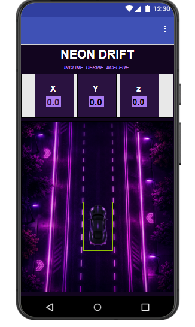
---

## Print da tela dos Blocos
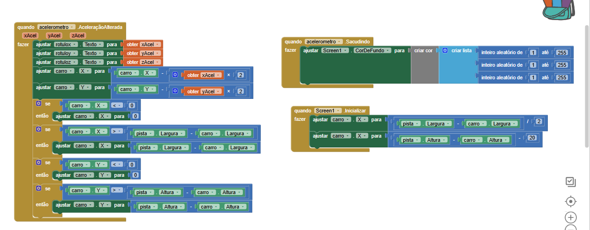

# Projeto 2 – MagicBall com Acelerômetro

## Descrição

**Objetivo do aplicativo:**  
O objetivo deste aplicativo é desenvolver uma aplicação utilizando o acelerômetro do celular para controlar uma bola na tela. A atividade apresenta uma continuação dos conhecimentos trabalhados anteriormente com o sensor, utilizando seus valores para criar uma interação diferente com o usuário. :contentReference[oaicite:0]{index=0}

**Funcionamento:**  
O aplicativo apresenta uma bola dentro de uma área de jogo. O movimento da bola é controlado a partir dos dados obtidos pelo acelerômetro do dispositivo.

Ao inclinar ou movimentar o celular, os valores identificados pelo sensor são utilizados para alterar a posição da bola na tela. Dessa forma, o jogador consegue controlar o deslocamento da bola utilizando os movimentos do próprio aparelho.

A atividade também trabalha elementos de jogo, como uma área delimitada para a movimentação da bola e a interação entre os componentes presentes na tela. :contentReference[oaicite:1]{index=1}

**Modificações realizadas:**  
Em relação ao exemplo apresentado na atividade, foram realizadas alterações na interface visual do aplicativo, buscando deixar a apresentação mais organizada e personalizada.

Foram modificados elementos visuais da tela e a organização dos componentes, mantendo como principal funcionalidade o uso do acelerômetro para controlar a movimentação da bola.

---

## Print das telas do Design

### Tela Inicial
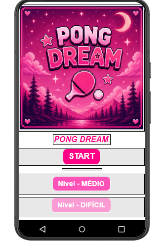

### Modo Fácil
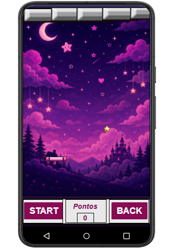

### Modo Difícil
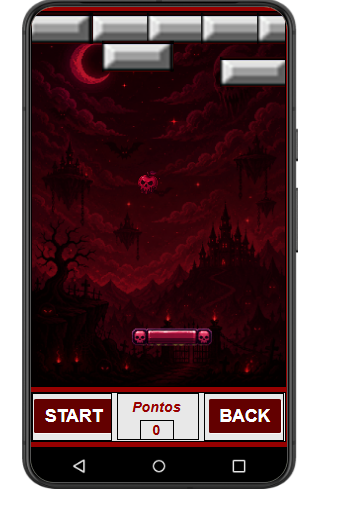

---

## Print das telas dos Blocos

### Blocos da Tela Inicial
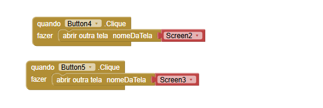

### Blocos do Modo Fácil
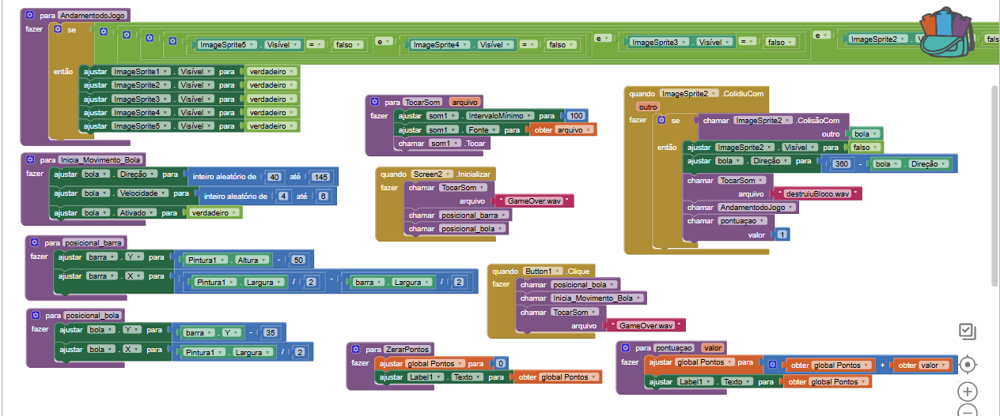
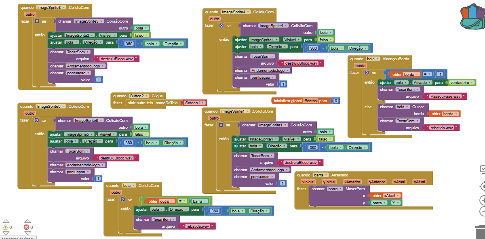
### Blocos do Modo Difícil
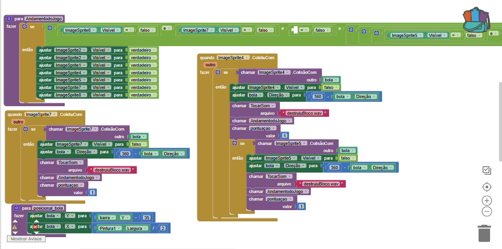
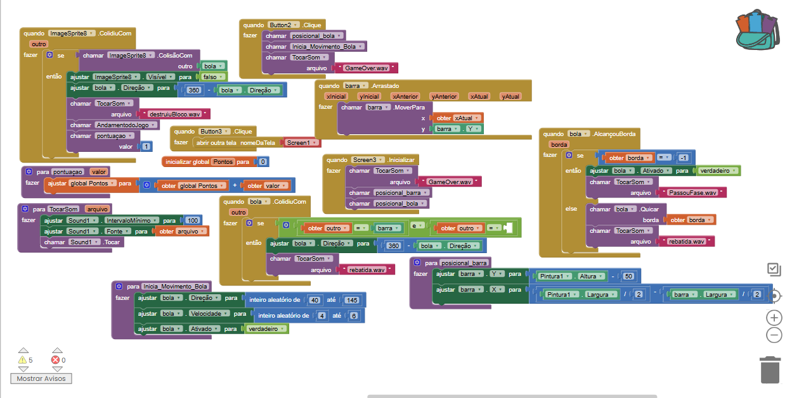
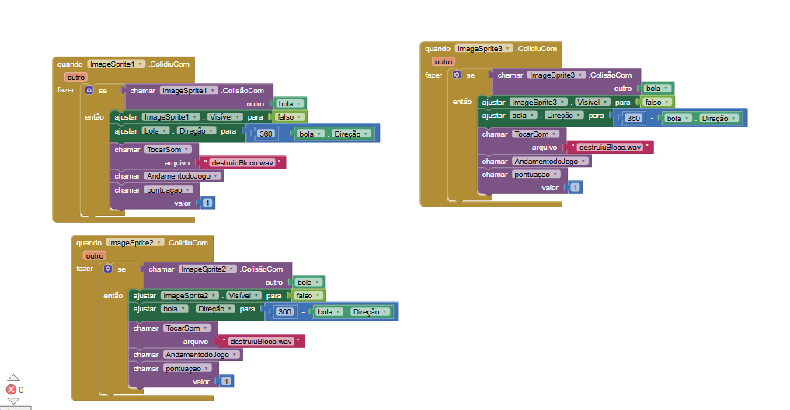

---

# Projeto 3 – Mesa de Bilhar

## Descrição

**Objetivo do aplicativo:**  
O objetivo deste aplicativo é desenvolver um jogo de bilhar utilizando recursos de movimentação, colisão e interação por gestos. A atividade permite compreender melhor o funcionamento do Canvas e dos elementos presentes dentro dele, além de trabalhar conceitos relacionados ao movimento e à redução da velocidade da bola.

**Funcionamento:**  
O aplicativo apresenta uma mesa de bilhar com uma bola que pode ser lançada pelo jogador através de um movimento realizado com o dedo na tela.

A direção e a força do movimento realizado pelo usuário determinam o deslocamento da bola. Quando ela atinge uma das bordas da mesa, ocorre uma rebatida, fazendo com que continue seu movimento em outra direção.

A velocidade da bola diminui gradualmente durante seu deslocamento, simulando o comportamento de uma bola em uma mesa de bilhar.

A mesa também possui seis caçapas. Quando a bola entra em uma delas, o aplicativo identifica a colisão, reproduz um efeito sonoro e reposiciona a bola para que uma nova jogada possa ser realizada.

**Modificações realizadas:**  
Em relação ao projeto original apresentado na apostila, foram realizadas diversas modificações para criar uma versão mais completa e personalizada do jogo.

A principal alteração foi a criação de uma nova identidade visual chamada **Damas de Ouro**, substituindo a mesa tradicional verde por mesas personalizadas e utilizando principalmente as cores rosa, preto e dourado.

Também foi criada uma tela inicial para o jogo, permitindo que o jogador escolha entre **Modo Fácil** e **Modo Difícil**. Cada modo possui sua própria mesa e apresenta diferenças na dificuldade da partida.

Foi adicionado um sistema de pontuação que contabiliza os acertos realizados pelo jogador. Ao atingir a quantidade necessária de pontos, o aplicativo apresenta uma mensagem de vitória.

Também foram adicionados novos efeitos sonoros, incluindo um som para os acertos e outro específico para a vitória.

Além disso, foram realizadas alterações na velocidade e na movimentação da bola, buscando deixar as jogadas mais rápidas e dinâmicas.

Com essas modificações, o aplicativo deixou de ser apenas uma demonstração simples do funcionamento de uma mesa de bilhar e passou a apresentar diferentes telas, níveis de dificuldade, pontuação, sons e uma identidade visual própria.

---

## Print das telas do Design

### Tela Inicial
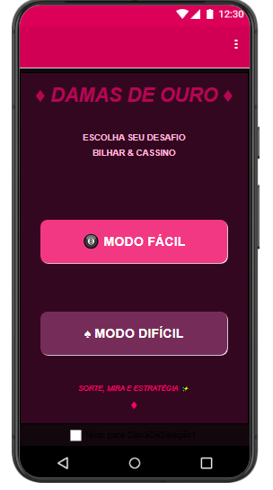

### Modo Fácil
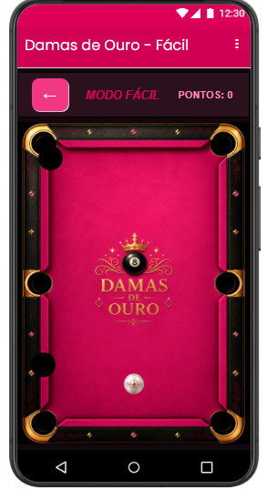

### Modo Difícil
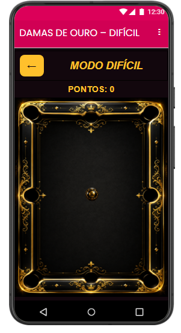

---

## Print das telas dos Blocos

### Blocos da Tela Inicial
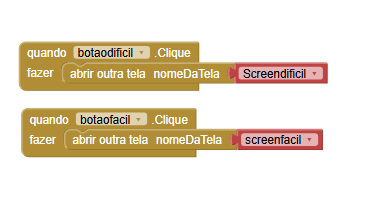

### Blocos do Modo Fácil
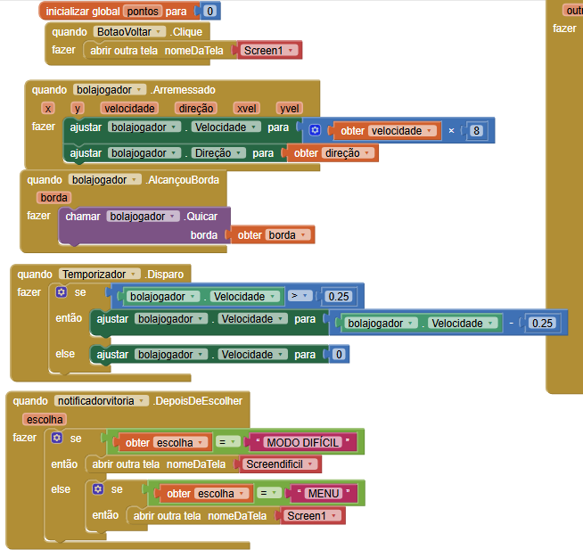
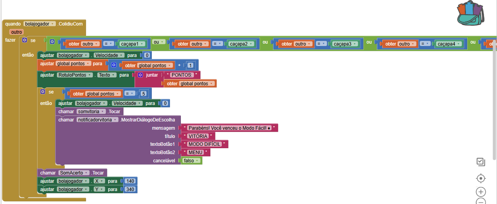
### Blocos do Modo Difícil
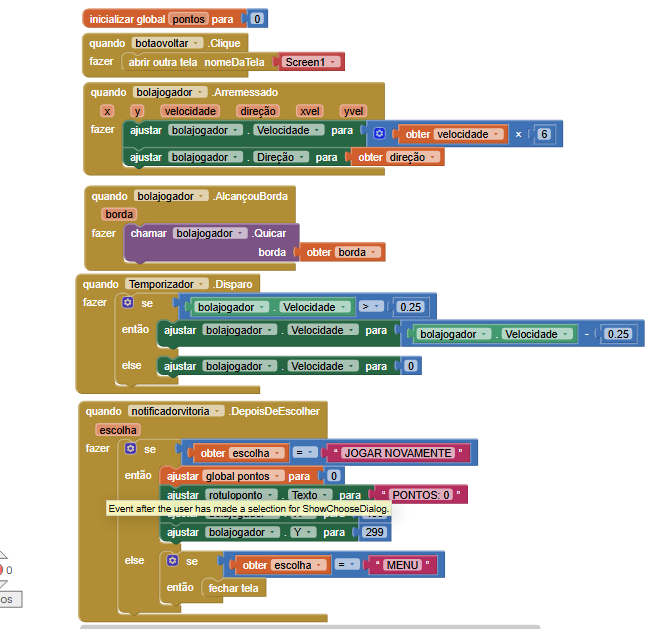
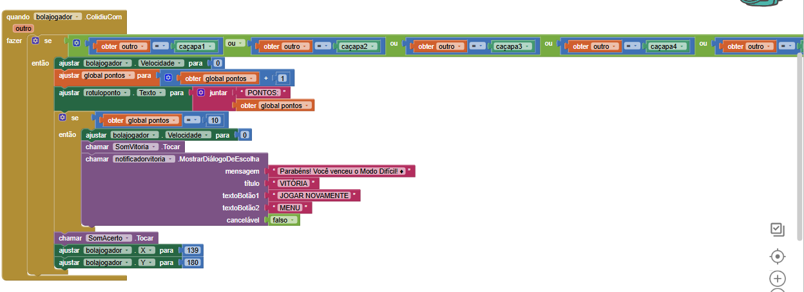

