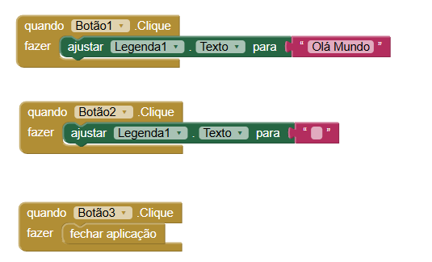

# Instituição 
`ETEC Vasco Antônio Venchiarutti`

---

# Curso
`Informática para Internet`

---

# Turma
`2°D`

---

# Autores
- `Maria Eduarda Pinto de Oliveira Rodrigues`
- `Mariana Rasmussen Rezende Alves`

---

# Projeto 1 – Primeiro Aplicativo (pg. 27)

## Descrição
**Objetivo do aplicativo:**  
O objetivo deste aplicativo é apresentar, de maneira simples, o funcionamento de eventos em aplicações móveis. Ao interagir com um botão presente na interface, o usuário recebe uma mensagem de saudação. O projeto tem como finalidade introduzir conceitos iniciais de programação, como a interação com elementos da interface e a exibição de mensagens na tela.

**Como ele funciona:**  
  O aplicativo apresenta um botão em sua interface principal. Sempre que o usuário interage com esse botão, é executada uma ação previamente programada que exibe a mensagem "Olá mundo" na tela. Esse funcionamento é controlado por blocos de programação responsáveis por identificar o clique e acionar a exibição da mensagem.

**Modificações ou melhorias em relação ao exemplo da apostila:**  
    Em relação ao exemplo apresentado na apostila, foram realizadas modificações na interface do aplicativo para torná-la mais organizada e visualmente agradável. Para isso, foram utilizados sistemas de organização horizontal, permitindo um melhor alinhamento dos elementos na tela e uma apresentação mais clara para o usuário. Essas alterações não modificam o funcionamento principal do aplicativo, mas melhoram sua aparência e usabilidade.

---
## 🖼️ Prints do Design

## 🧩 Prints dos Blocos

# Projeto 2 – Segundo Aplicativo (pg. 46)

## Descrição
**Objetivo do aplicativo:**  O objetivo deste aplicativo é possibilitar que o usuário realize desenhos na tela utilizando diversas cores. O projeto foi desenvolvido com a finalidade de demonstrar conceitos de interação com múltiplos botões e manipulação de elementos gráficos, permitindo que o usuário selecione diferentes cores para criar seus desenhos.

**Funcionamento:**  
   O aplicativo apresenta quatro botões, cada um associado a uma cor diferente de pincel. Ao selecionar um desses botões, a ferramenta de desenho passa a utilizar a cor correspondente na tela. Dessa forma, o usuário pode desenhar livremente na área disponível. Além disso, há um botão localizado na parte inferior da interface que permite limpar o desenho, removendo tudo o que foi feito e possibilitando iniciar um novo desenho.

**Alterações feitas em relação à apostila:**  
    Em relação ao exemplo apresentado na apostila, foram realizadas algumas modificações na interface do aplicativo com o objetivo de melhorar sua estética e organização. Foram utilizadas organizações horizontais para alinhar melhor os botões na tela, deixando o layout mais estruturado e agradável visualmente. Também foi alterada a imagem de fundo do aplicativo para a imagem de um quadro, tornando o visual mais coerente com a proposta do aplicativo, que é desenhar na tela.

---

## Print das telas do Design

---

## Print das telas dos Blocos

---

# Projeto 3 – Terceiro Aplicativo (pg. 56)

## 📖 Descrição
**Objetivo:**  
  O objetivo deste aplicativo é demonstrar o uso de recursos do dispositivo móvel, como vibração e reprodução de sons. A proposta do projeto é criar uma interação simples e divertida, onde o usuário pode simular o funcionamento de um liquidificador ao tocar na imagem exibida na tela.
  
**Funcionamento:**  
   O aplicativo exibe, no centro da tela, a imagem de um liquidificador. Ao clicar sobre essa imagem, o sistema realiza duas ações ao mesmo tempo: o dispositivo inicia a vibração e reproduz um som característico de liquidificador, simulando seu funcionamento. Além disso, na parte inferior da interface, há um botão que possibilita ao usuário encerrar e sair do aplicativo.
   
**Modificações realizadas:**  
    Em relação ao exemplo apresentado na apostila, foram realizadas algumas alterações na interface do aplicativo para melhorar a organização dos elementos na tela. Para isso, foram utilizadas organizações horizontais, deixando o layout mais alinhado e visualmente mais agradável. Também foi realizada uma modificação na programação da vibração do dispositivo, aumentando sua duração de 3000 milissegundos para 5000 milissegundos, tornando o efeito mais perceptível durante a interação.

---

## Print das telas do Design

---

## Print das telas dos Blocos

---

# Projeto 4 – Quarto Aplicativo (pg. 64)

## Descrição
**Objetivo:**  
    O objetivo deste aplicativo é apresentar o uso da câmera do celular dentro de uma aplicação. A proposta consiste em permitir que o usuário capture uma imagem utilizando o próprio dispositivo e, em seguida, visualize essa foto diretamente na tela do aplicativo.
    
**Funcionamento:**  
    O aplicativo conta com um botão que possibilita ao usuário acessar a câmera do celular e capturar uma foto. Após a realização do registro, a imagem obtida é exibida na tela principal, permitindo a visualização do resultado. Além disso, na parte inferior da interface, há um botão que permite encerrar e sair do aplicativo.
    
**Modificações realizadas:**  
    Em relação ao exemplo apresentado na apostila, foram realizadas alterações na interface para melhorar a organização e o visual do aplicativo. Os botões foram organizados utilizando estruturas horizontais e receberam cores diferentes, tornando a interface mais clara e agradável para o usuário. Também foi adicionada uma funcionalidade extra: após tirar a foto, o aplicativo exibe um texto na tela comentando que a foto ficou boa, adicionando um pequeno feedback ao usuário após a captura da imagem.

---

## Print das telas do Design

---

## Print das telas dos Blocos

---

# Projeto 5 – Quinto Aplicativo (pg. 69)

## Descrição
**Objetivo:**  
    O objetivo deste aplicativo é apresentar a utilização de múltiplas telas dentro de um mesmo projeto, possibilitando a navegação entre diferentes seções da aplicação. A proposta consiste em demonstrar como um aplicativo pode organizar suas funcionalidades em telas distintas, contribuindo para uma melhor estruturação e uma experiência mais eficiente para o usuário.

**Funcionamento:**  
    O aplicativo apresenta uma tela inicial com dois botões principais. Ao selecionar qualquer um deles, o usuário é direcionado para uma das duas telas disponíveis na aplicação. Em cada uma dessas telas, também estão presentes botões que permitem retornar à tela inicial ou navegar entre as demais.

Na Tela 1, foi implementada uma funcionalidade que faz o dispositivo vibrar sempre que o usuário interage com o aplicativo. Já na Tela 2, foi desenvolvido um pequeno painel de sons (soundboard), composto por quatro botões, sendo que cada um reproduz um áudio diferente ao ser acionado.

**Modificações realizadas:**  
    Em relação ao exemplo apresentado na apostila, foram realizadas diversas melhorias na interface do aplicativo, com o objetivo de deixá-la mais organizada e visualmente mais agradável. Foram feitas mudanças no estilo dos botões, nos fundos das telas e nos textos exibidos. Também foi adicionada uma imagem na tela inicial para melhorar a apresentação do aplicativo. Além disso, foram implementadas novas funcionalidades nas telas secundárias: a Tela 1 passou a ter um recurso de vibração do celular, enquanto a Tela 2 recebeu um soundboard com quatro sons diferentes, ampliando as possibilidades de interação do aplicativo.

---

## Print das telas do Design

---

## Print das telas dos Blocos

---

# Projeto 6 – Sexto Aplicativo (pg. 82)

## Descrição
**Objetivo:**  
    O objetivo deste aplicativo é apresentar a utilização da entrada de dados por meio do teclado do celular em uma aplicação. A proposta é permitir que o usuário insira seu nome e receba uma mensagem personalizada, evidenciando como as informações fornecidas podem ser processadas e utilizadas pelo próprio aplicativo.
    
**Funcionamento:**  
   O aplicativo conta com um campo de texto que permite ao usuário inserir seu nome por meio do teclado do celular. Após digitar o nome e confirmar a ação, o sistema exibe uma mensagem na tela contendo o nome informado, gerando uma resposta personalizada. Dessa forma, o aplicativo exemplifica como coletar e utilizar dados fornecidos pelo usuário durante sua execução.

**Modificações realizadas:**  
    Em relação ao exemplo apresentado na apostila, foram feitas algumas alterações na interface e na funcionalidade do aplicativo. A cor dos botões foi modificada para melhorar o visual e tornar a interface mais agradável. Além disso, foi implementada uma nova opção que permite ao usuário digitar também a sua cidade. Essa informação é exibida juntamente com o nome na mensagem final, tornando a resposta do aplicativo ainda mais personalizada.

---

## Print das telas do Design

---

## Print das telas dos Blocos

---

*Repositório criado para fins educacionais no curso de Informática para Internet.*
