# 📱 Relatório – Desenvolvimento de Aplicativos (App Inventor)

---

## Instituição
Etec VAV

## Curso
Informática para Internet

## Turma
2º Ano – Ensino Médio Integrado

## Autores
Natan (Na Na)  
Lucas

---

# Projeto 1 – Primeiro Aplicativo (pg. 27)

### Descrição
Este primeiro aplicativo tem como objetivo apresentar o funcionamento básico do App Inventor, criando uma interface simples com um botão que interage com o usuário.

O funcionamento consiste em exibir uma mensagem na tela ao clicar no botão, demonstrando o uso de eventos e componentes básicos como **Button** e **Label**.

Como melhoria, foi possível personalizar textos e ajustar o layout para deixar a interface mais organizada e visualmente agradável.

### Print das telas do Design

| Imagem | Descrição |
|------|----------|
| 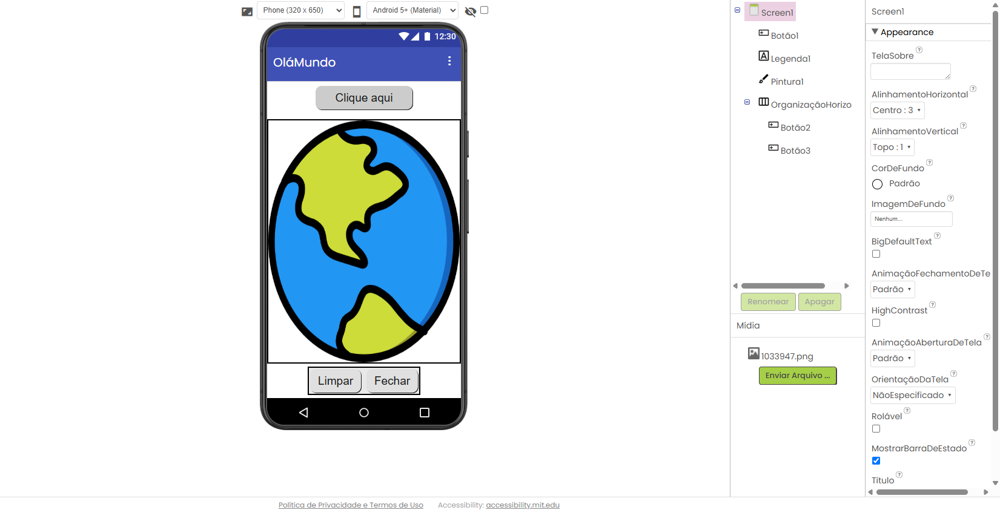 | Interface simples com botão e texto exibido ao usuário |

### Print das telas dos Blocos

| Imagem | Descrição |
|------|----------|
| 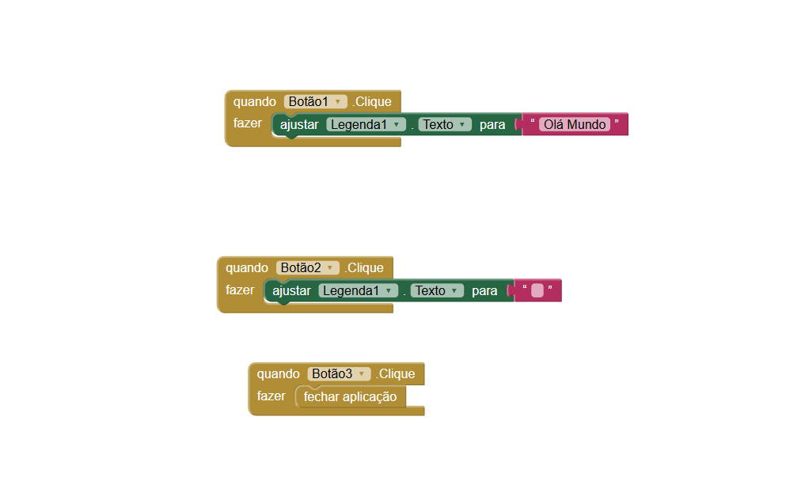 | Blocos de evento responsáveis por alterar o texto ao clicar no botão |

---

# Projeto 2 – Segundo Aplicativo (pg. 46)

### Descrição
Este aplicativo introduz interação com imagens, permitindo ao usuário visualizar e manipular elementos visuais.

O funcionamento consiste em exibir uma imagem e permitir ações sobre ela, como mudanças ou interações simples.

Como melhoria, foram feitos ajustes no posicionamento da imagem e organização dos componentes para melhor experiência do usuário.

### Print das telas do Design

| Imagem | Descrição |
|------|----------|
| 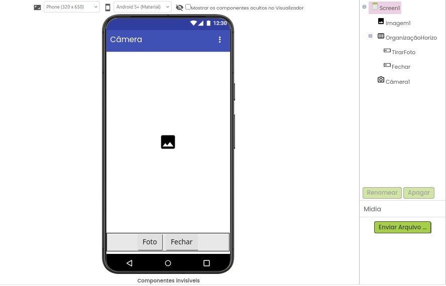 | Interface com componente de imagem e botão de ação |

### Print das telas dos Blocos

| Imagem | Descrição |
|------|----------|
| 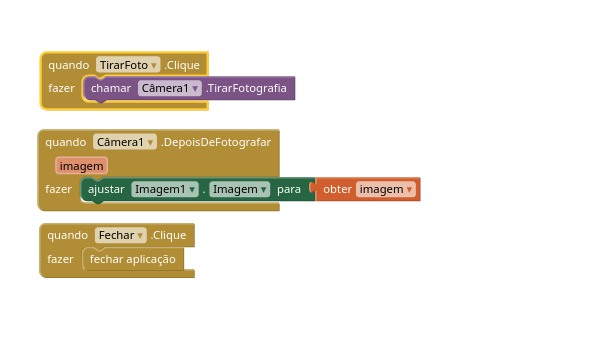 | Blocos responsáveis pela manipulação da imagem |

---

# Projeto 3 – Terceiro Aplicativo (pg. 56)

### Descrição
O objetivo deste aplicativo é trabalhar com desenhos na tela, utilizando o componente **Canvas**.

O usuário pode interagir diretamente com a tela, desenhando com o toque, o que demonstra o uso de eventos de movimento.

Como melhoria, foi possível ajustar cores e espessura do traço, tornando o aplicativo mais interativo.

### Print das telas do Design

| Imagem | Descrição |
|------|----------|
| 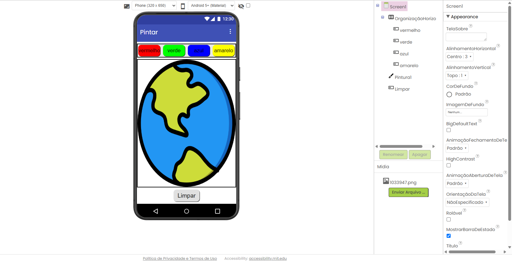 | Tela com área de desenho (Canvas) |

### Print das telas dos Blocos

| Imagem | Descrição |
|------|----------|
| 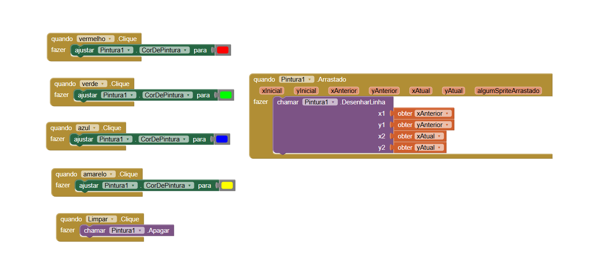 | Blocos que controlam o desenho com base no toque |

---

# Projeto 4 – Quarto Aplicativo (pg. 64)

### Descrição
Este aplicativo simula o funcionamento de um liquidificador, utilizando lógica de controle e troca de estados.

O funcionamento consiste em ativar e desativar o “liquidificador” através de botões, alterando imagens ou estados visuais.

Como melhoria, foram ajustadas as transições e organização dos elementos para melhor compreensão visual.

### Print das telas do Design

| Imagem | Descrição |
|------|----------|
| 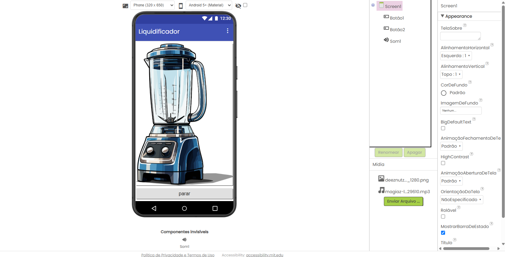 | Interface com botão de controle e imagem do liquidificador |

### Print das telas dos Blocos

| Imagem | Descrição |
|------|----------|
| 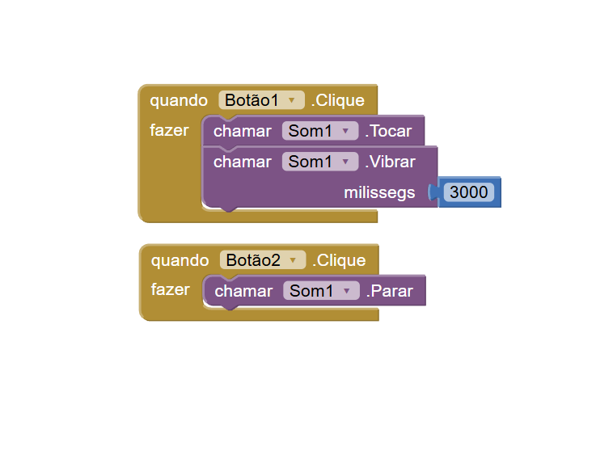 | Blocos responsáveis por ligar/desligar e trocar estados |

---

# Projeto 5 – Quinto Aplicativo (pg. 69)

### Descrição
Este projeto introduz o conceito de múltiplas telas, permitindo navegação entre diferentes interfaces dentro do aplicativo.

O funcionamento consiste em trocar de tela ao clicar em botões, simulando um fluxo de navegação.

Como melhoria, foi organizada melhor a estrutura entre telas, garantindo uma navegação mais clara.

### Print das telas do Design

| Imagem | Descrição |
|------|----------|
| 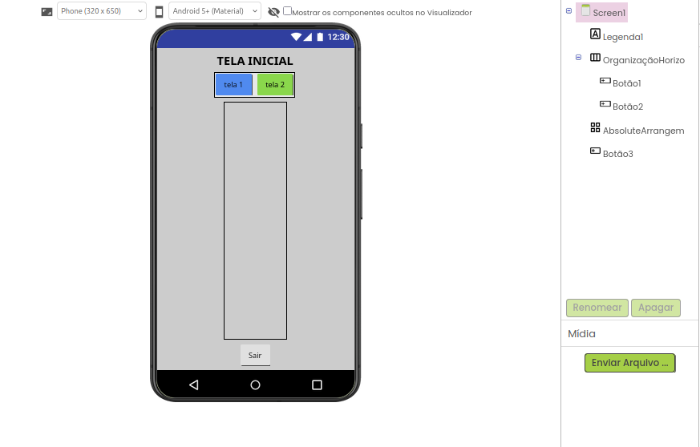 | Primeira tela do aplicativo |
| 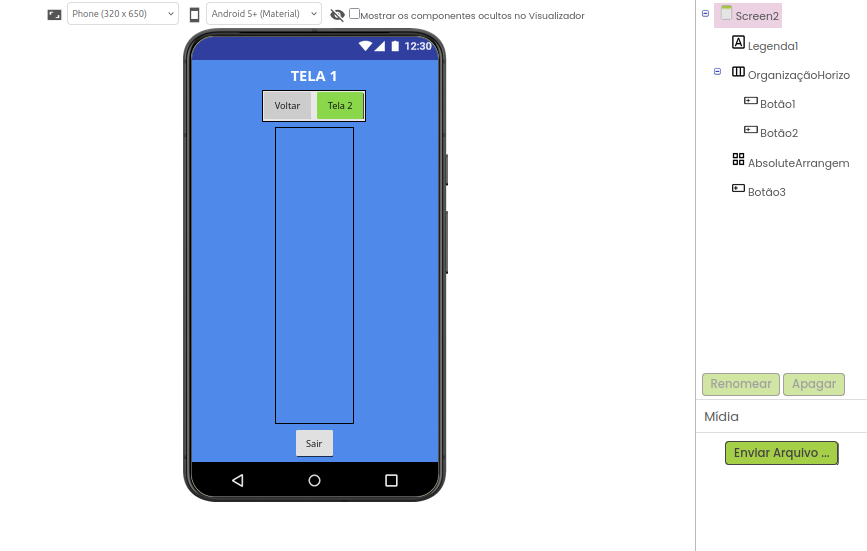 | Segunda tela do aplicativo |
| 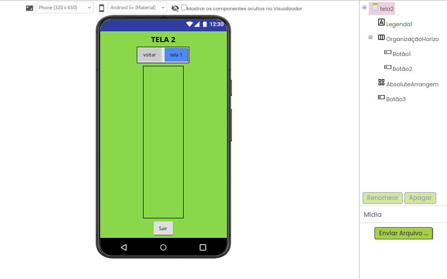 | Terceira tela do aplicativo |

### Print das telas dos Blocos

| Imagem | Descrição |
|------|----------|
| 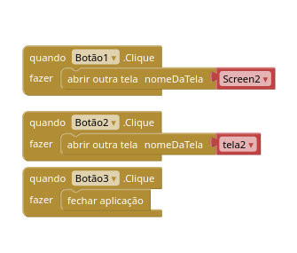 | Blocos de navegação entre telas |
| 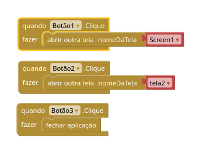 | Controle de troca de telas |
| 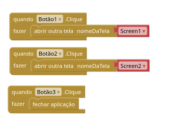 | Organização da lógica de navegação |

---

# Projeto 6 – Sexto Aplicativo (pg. 82)

### Descrição
Este aplicativo representa um avanço na construção de interfaces e lógica, combinando vários conceitos aprendidos anteriormente.

Ele utiliza múltiplos componentes e interações, mostrando como estruturar um aplicativo mais completo.

O funcionamento envolve interação do usuário com diferentes elementos e resposta dinâmica da aplicação.

Como melhoria, foram feitos ajustes na interface e organização dos blocos para deixar o código mais limpo e compreensível.

### Print das telas do Design

| Imagem | Descrição |
|------|----------|
|  | Interface geral do aplicativo com múltiplos componentes |

### Print das telas dos Blocos

| Imagem | Descrição |
|------|----------|
|  | Estrutura lógica do aplicativo com blocos organizados |

---

# 📌 Considerações Finais

Durante o desenvolvimento dos aplicativos, foi possível compreender na prática como funciona a construção de apps utilizando o App Inventor.

Aprendemos:
- criação de interfaces (Design)
- programação com blocos
- uso de eventos
- navegação entre telas

A atividade permitiu desenvolver não apenas habilidades técnicas, mas também organização e documentação, que são essenciais no desenvolvimento de software.

Assim como em Provérbios 16:3:  
_"Consagre ao Senhor tudo o que você faz, e os seus planos serão bem-sucedidos."_  

Esse projeto foi uma construção passo a passo, e cada aplicativo contribuiu para um entendimento maior da lógica de programação.

---
